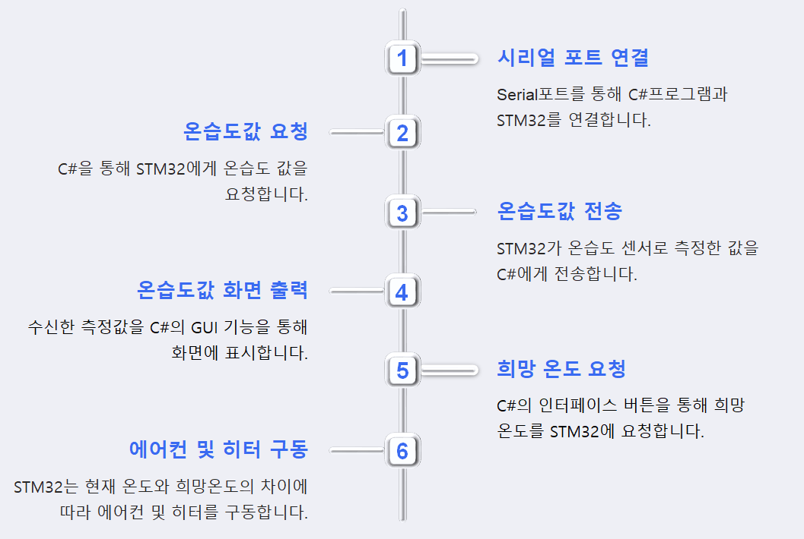

# Temperature_control_system
## 프로젝트 목적
희망온도와 현재온도를 비교하여 에어컨 혹은 히터를 자동으로 제어합니다.
## 사용 디바이스
stm32f411, 온습도센서, Red LED(히터역할), DC motor&프로펠러(에어컨역할)
## 개발환경
STM32CubeIDE, Visual Studio(.NET framework)
## 흐름도

## 시연영상

시연영상에 대한 설명 
1. 통신설정 및 재시작. 하단 상태표시줄에 연결상태 표시됨. 
2. 현재온도보다 희망온도를 높아지게 설정. 희망온도 - 현재온도의 차이가 커질수록 Red LED가 더 밝아짐.(PWM사용) 
3. 현재온도보다 희망온도를 낮아지게 설정. 희망온다 - 현재온도의 차이가 커질수록 모터가 더 빨리돈다.(PWM사용) 

원본영상(이 링크의 raw file 다운로드시 좀 더 크고 명확한 영상을 확인하실 수 있습니다. ) : (https://github.com/BrotherHwan/Temperature_control_system/blob/main/image_video/C%23%ED%94%84%EB%A1%9C%EC%A0%9D%ED%8A%B8%20%EC%8B%9C%EC%97%B0%EC%98%81%EC%83%81.mp4)
